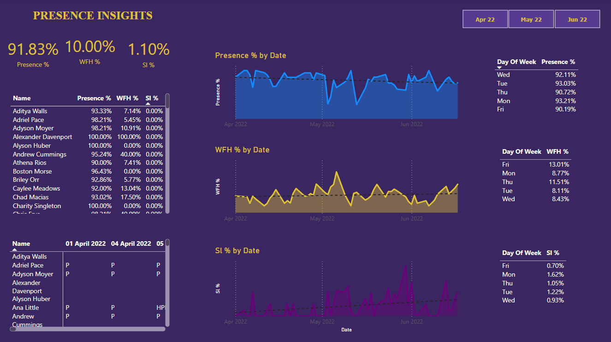

# Project Title

*HR Analytics Dashboard*

# Overview

This project involves an in-depth analysis of employee attendance and leave patterns using complex DAX queries, filtering, and advanced data visualization tools. The analysis focuses on key metrics such as office presence percentage, work-from-home percentage, and sick leave trends. Using PowerBI, interactive visualizations like area charts, matrix tables, and table measures were employed to provide actionable insights. The project aims to help HR teams understand workforce dynamics and make informed decisions regarding employee productivity and attendance management.

# Project Objectives

- Analyze the percentage of office presence and work-from-home rates.
- Identify patterns in sick leave and absenteeism.
- Utilize advanced data visualizations to present insights for improving HR strategies.
- Convert raw data sheets into structured tables for analysis.
  
# Data Overview

- Data Source: HR internal system
- Key columns include employee_name, department, date_of_attendance, attendance_status (office, WFH, sick leave), etc.
- Number of records in the dataset
  
# Parameter
- WFH%, SL%, Presencce%
  
# Analysis Workflow

- Complex DAX Queries: Using DAX functions to calculate various metrics such as % presence and % work-from-home.
- Data Visualization: Creating interactive visualizations such as area charts, matrix tables, and detailed table measures.
- Insights and Conclusions: Summarizing key findings to optimize attendance policies and track absenteeism trends.

# Key Insights

- Office Presence: The percentage of employees attending the office regularly.
- Work-from-Home: The proportion of employees opting for remote work over a period.
- Sick Leave Patterns: Trends in employee absenteeism due to health issues.
  
# Technologies Used

- Platform: PowerBI
- Tools: PowerBI (for visualizations and dashboard creation)
- Techniques: DAX Queries, Filtering, Area Charts, Matrix Tables, Table Measures
  
# Link To Dashboard
https://app.powerbi.com/groups/me/reports/88137ab6-ef89-4994-8600-9056e4761c9e/f08c281c30e34403c701?experience=power-bi

# Dashboard Visuals

# Results and Recommendations
- Monitor employee presence and absenteeism to manage workforce availability effectively.
- Leverage work-from-home data to inform remote work policies and optimize productivity.
- Use sick leave trends to develop better health and wellness programs for employees.

# Conclusion

The HR Analytics project revealed important insights into employee attendance, work-from-home trends, and sick leave patterns. These insights enable HR teams to make data-driven decisions, improving employee management and productivity strategies. The interactive PowerBI dashboard allows easy exploration of the metrics, making it accessible for HR stakeholders to evaluate workforce dynamics efficiently.
